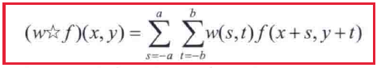
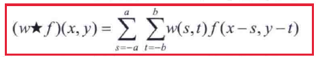
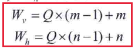

## 3.3 直方图处理

直方图定义：

M、N分别是图像的行数和列数。

像素占据整个灰度级范围并且均匀分布的图像,将具有高对比度的外观和多种灰色调，如下图所示：

### 3.3.1直方图均衡化

1.直方图映射公式：
$$
s=T(r)
$$
r是映射前的灰度值，s是映射后的灰度值，T(r)是单调递增映射函数，以防止灰度反转而产生伪影。

2、直方图均衡的一个重要映射函数：

离散化的形式表示为：

直方图是概率密度函数的近似，在这个过程中不允许产生新的灰度级。

### 3.3.2直方图匹配化

就是生成具有规定直方图特征的图像的方法。

离散直方图规定化的流程：

> 需要说明的是：
>
> 由于直方图均衡化会拉升灰度级，所以直方图均衡化通常会增强图像的灰部区域噪声，使用规定直方图保持暗部直方图特征而拉升其他部分可降低噪声的引入

### 3.3.3局部直方图处理

基于像素邻域的灰度变换:定义一个邻域，并将其中心在水平方向或垂直方向上从一个像素移动到另一个像素。在每个位置，计算邻域中各点的直方图，得到直方图均衡化或直方图规定化变换函数。这个函数只用于映射邻域中心像素的灰度值。

### 3.3.4使用直方图统计量增强图像

通常统计图像的均值和方差；

1、均值是图像平均灰度的测度：

2、方差/标准差是图像对比度的测度：

3、基于邻域的图像增强的方法：

1）计算图像中每个像素的邻域$S_{xy}$均值$m_{xy}$和方差$σ_{xy}$

2）根据该像素邻域的均值和方与整幅图像的均值和方差进行如下比较：

其中$k_0$和$k_1$、$k_2$和$k_3$以及C是人为指定的权重，如果在其范围内则该像素乘以常数C表示增强该像素。

## 3.4空间滤波基础

基本原理：空间滤波把每个像素的值替换为该像素及其邻域的函数值来修改图像

### 3.4.2空间相关与卷积

1、空间相关：

2、空间卷积：

> 需要注意的是：卷积性质包括交换律、结合律与分配律；而相关则只有分配律成立

3、卷积核的合成

如果图像有Q个阶段的滤波，每个阶段滤波对应一个核，则可以先合成所有核，然后图像与合成的核进行卷积。核的合成和最终核的大小为：

4、卷积核的分解

同理，核也可以通过分解来逐步对图像进行卷积：

### 3.4.5构建滤波核的方法

1、根据数学特性，例如邻域像素平均值滤波（盒式滤波核）

2、对形状具有所需性质的二维空间函数进行取样得到（高斯滤波核）

3、在频率域中设计具有规定频率响应的滤波器
