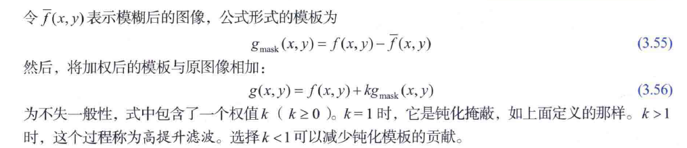

## 3.5 平滑（低通）空间滤波器

### 3.5.1 盒式滤波器

就是卷积核的值全是1的滤波器，并且带有一个**归一化系数**

> 归一化的目的：
>
> 1. 灰度平坦的区域的滤波后的值要等与原来的值
> 2. 防止滤波的过程中引入偏差（滤波前后图像所有像素的值相等）

核的大小和图像特征的大小的关系会影响到滤波的效果！

### 3.5.2 低通高斯滤波器

高斯核由均值和标准差定义，对称高斯核是可分离的！

根据高斯函数的特点，到均值距离大于$3\sigma$的点的值可以小到忽略不计（数值在$3\sigma$范围内的概率达到了0.9974）。

所以，高斯滤波器核的大小最大一般就是$\lceil 6\sigma\rceil \times \lceil 6\sigma\rceil $。

两个高斯函数的**乘积**or**卷积**也是高斯函数。

要实现同样的（差不多的）模糊效果，高斯核的大小一定要大于盒式滤波器！（因为高斯核中心的当前点的权重最大）

高斯核的边缘更平滑

> 3种填充边缘的方法：
>
> 1. 最简单的补0，但是会有黑边
> 2. 镜像/对称填充，适合边缘细节较多的情况
> 3. 复制填充，适合边缘较平坦的情况

核的大小和图像分辨率的大小会影响到滤波效果！（对应前一小节说的最后一句

可以结合不同的图像处理方法来达到目的，例如，先进行低通滤波，然后进行灰度阈值处理来进行分割（例3.15）

低通滤波还可以用来进行LSC——例3.16，使用一个超大的高斯核（512x512）

### 3.5.3 统计排序（非线性）滤波器

经典的：中值滤波器、最小值滤波器、最大值滤波器

中值滤波器对椒盐噪声很有用（或者类似的冲击噪声）

## 3.6 锐化（高通）空间滤波器

平滑是积分，锐化是微分

噪声也会被增强

常用的锐化算子：

1. 拉普拉斯算子——二阶导
2. 梯度——一阶导，具体有Robert交叉算子、Sobel算子，这两个都是**有方向的**

> 一阶导和二阶导的区别
>
> 1. 二阶导注重更精细的细节（一阶导有变化的细节），对于斜率（一阶导）不变的区域，二阶导就变成0了，直观的理解就是缓慢均匀变换的区域，二阶导就检测不到。
> 2. 二阶导有“反冲”（我自己称作反冲hhh）现象——有过零点

一阶导，二阶导都是线性的

> 各向同性 VS 各向异性
>
> 说简单点，就是各个方向的性质相不相同，相同的话就是各向同性，否则就是各向异性
>
> 对于滤波算子来说，就是以核的中心为原点，各个方向的差值是不是相同。不同的核还分90°各向同性还是45°各向同性，比如下图的a和c就是90°的各向同性，b和d是45°的各向同性。
>
> [高斯分布、多维高斯分布、各向同性的高斯分布及多元高斯分布之间的KL散度 - 那抹阳光1994 - 博客园 (cnblogs.com)](https://www.cnblogs.com/jiangkejie/p/12939776.html)

二阶导的核分正负的！

使用二阶导进行图像增强，需要将拉普拉斯滤波后的结果与原图“相加”，具体公式如下：

$g(x,y)=f(x,y)+c[\nabla^2 f(x,y)]$

当拉普拉斯的中心权重是负号时，c取-1，反之取1。

常用的拉普拉斯有四种：

b和d考虑到了对角线上的二阶导，锐化效果更强（

### 3.6.3 钝化掩蔽和高提升滤波

钝化掩蔽步骤：

1. 模糊原图像
2. 从原图像减去模糊后的图像
3. 将模板与原图像相加

