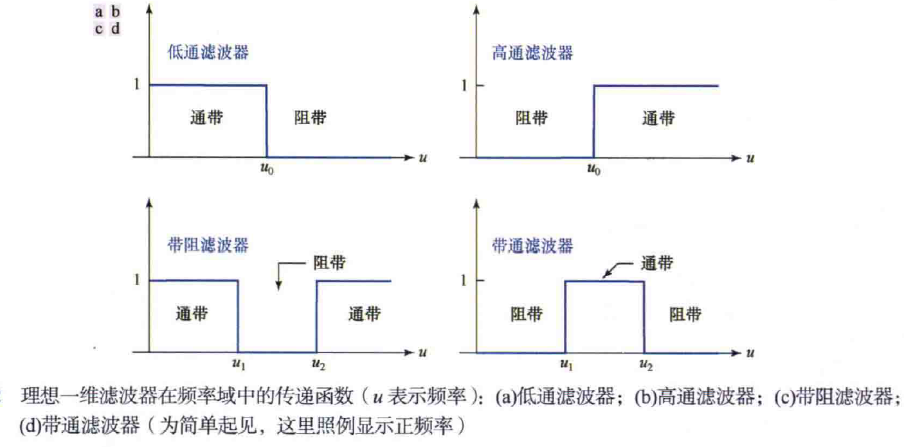
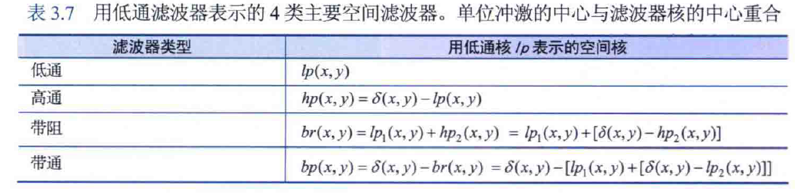
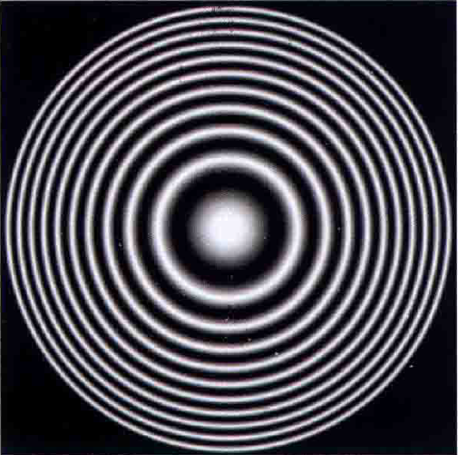

## 3.7低通、高通、带阻和带通滤波器

四种滤波器示意图：

高通、带通、带阻滤波器都可以使用低通滤波器和单位冲击响应构成：

通常用来测试四种滤波方法特性的图像：

## 3.8组合使用空间增强的方法

1、组合是指将平滑、低通、高通、直方图变换、幂律变换等多种方法结合来增强图像。

2、梯度对明显的灰度过渡区域（斜坡和台阶）的响应，要强于拉普拉斯对这些区域的响应。梯度对于噪声和精细细节的响应要比拉普拉斯对这些内容的响应低。

3、具有重要边缘内容的图像的梯度值要高于拉普拉斯图像中的梯度值。