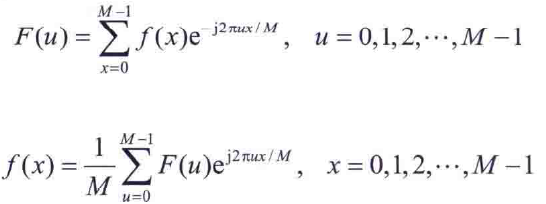
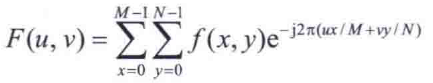
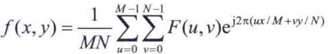
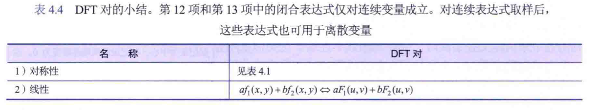
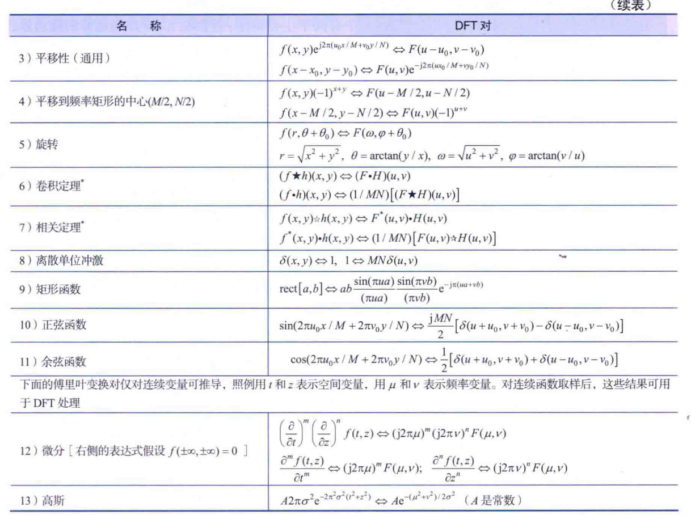

## 4.4 单变量的傅里叶变换

单变量离散傅里叶变换对：

## 4.5 二变量函数的傅里叶变换

1、二维连续傅里叶变换对：

4.5.4 图像中的混叠

1、空间混叠是由欠取样造成的，且在模式重复的图像中更为明显

2、时间混叠与动态图像序列中图像的时间间隔相关

3、在图像被取样之前，必须进行抗混叠滤波

### 4.5.5 二维离散傅里叶变换及其反变换

## 4.6 二维DFT和IDFT的一些性质

