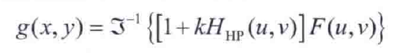

## 4.8 使用低通频率域滤波器平滑图像

1、理想低通滤波器（ILPF）

理想低通滤波器的陡峭截止频率特性不能使用电子元件来实现，但可以在计算机上模拟；且理想低通滤波器存在振铃效应。

2、高斯低通滤波器（GLPF）

与理想低通滤波器相比，高斯低通滤波器实现的平滑稍少一些，但优点是不会出现振铃效应。

3、巴特沃斯低通滤波器（BLPF）

巴特沃斯低通滤波器使用较高的n参数可以逼近理想低通滤波器，使用较低的n参数可以逼近高斯低通滤波器，因此巴特沃斯的低通滤波特性介于理想低通和高斯低通之间，通过调整参数n来控制其特性 。

## 4.9 使用高通滤波器锐化图像

### 4.9.1 由低通滤波器得到理想、高斯和巴特沃斯高通滤波器

高通滤波器可以由全通滤波器减去相应的低通滤波器得到，如下：

1、理想高通（IHPF）

2、高斯高通（GHPF）

3、巴特沃斯高通（BHPF）

高通滤波的主要目的是锐化图像，一般移除图像的低频分量会明显降低图像的灰度，留下的大部分是边缘和其他急剧过度的地方。

4、 频率域中的拉普拉斯

### 4.9.3 钝化掩蔽、高提升滤波和高频强调滤波

当k=1时为钝化掩蔽，k>1时为高提升滤波。

上式使用高通滤波器来表示为

上式方括号中的表达式被称为高频强调滤波器传递函数。

通过改进后得到更为一般的高频强调滤波通用公式为：

其中,k1>0偏移传递函数的值，以便直流项不为零，而k2>0控制高频的贡献。

### 4.9.4 同态滤波

图像可以表示为照射分量和反射分量的乘积：

为了分量两个分量进行分别处理，可以通过Log函数来分离：

图像中的照射分量通常由慢空间变化来表征，而反射分量往往倾向于突变。由此可以将图像取对数后的傅里叶变换的低频与照射联系起来，而将高频与反射联系起来。

同态滤波一般步骤为：

