## 5.3 只存在噪声的复原——空间滤波

### 5.3.1 均值滤波

1、算数平均滤波

与盒式滤波器相同，使用像素领域mxn子窗口的平均值来替代该像素值：

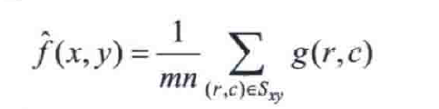

2、几何均值滤波器

每个复原像素是子图像区域中所有像素之积的1/mn次幂

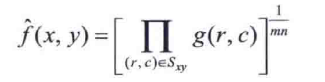

几何均值滤波器实现的平滑可与算数平均滤波器相比，但损失的细节更少。

3、谐波平均滤波器

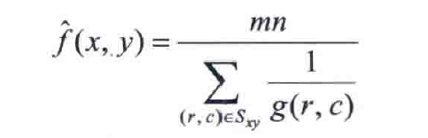

谐波平均滤波器既能处理盐粒噪声，又能处理类似于高斯噪声的其他噪声，但不能处理胡椒噪声。

4、反谐波平均滤波器

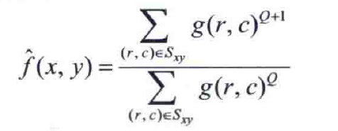

其中，Q为滤波器的阶数，Q为正值时，该滤波器消除胡椒噪声；Q为负值时，该滤波器消除盐粒噪声。但该滤波器不能同时消除这两种噪声。

### 5.3.2 统计排序滤波器

1、中值滤波器

中值滤波器能有效降低某些随机噪声，且模糊要小的多。

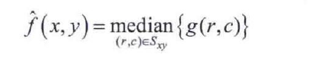

2、最大值滤波器和最小值滤波器

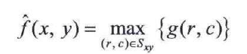

最大值滤波器可以找到图像中的最亮点，用于削弱与明亮区域相邻的暗色区域，因此可以降低胡椒噪声。

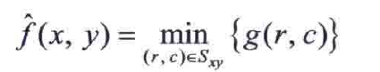

最小值滤波器可以找到图像中的最暗点，用于削弱与暗色区域相邻的明亮区域，因此可以降低盐粒噪声。

3、中点滤波器

计算滤波器包围区域中最大值和最小值之间的中点的值

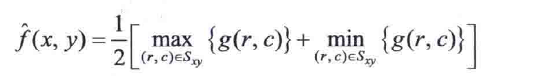

该滤波器是统计排序滤波器和平均滤波器的结合，适合处理随机分布的噪声，如高斯噪声或均匀噪声。

### 5.3.3自适应滤波器

1、自适应局部降噪滤波器

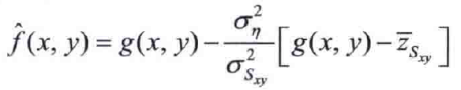

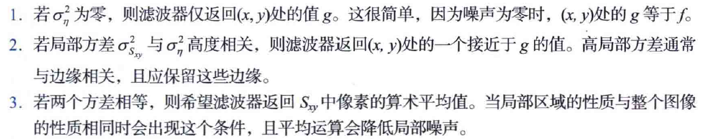

2、自适应中值滤波器

## 5.4使用频率域滤波降低周期噪声

### 5.4.1陷波滤波器

1、一般形式：由两个中心平移到陷波器中心的高通滤波传递函数乘积构成

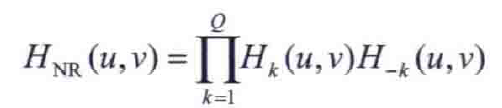

例如，一个具有三个陷波对的、阶数为n的巴特沃斯陷波带阻滤波器传递函数为：

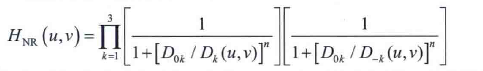

理想、高斯和巴特沃斯陷波器透视图：

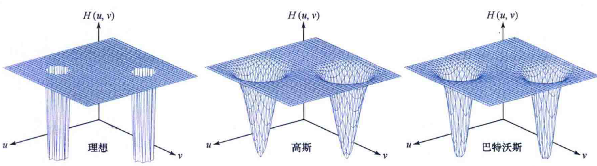

注意：近似水平的噪声模式，在频率域中的贡献将集中在DFT的纵轴

在图像频率域的原点位置不进行滤波，以免消除直流项和低频项

### 5.4.2最优陷波滤波

思想：将首先分离干扰模式的各个主要贡献，然后从被污染的图像中减去该模式的一个可变加权部分。例如，若只有噪声模式时：

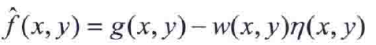

选取使f(x,y)的估计在每点（x,y）邻域上方差最小:

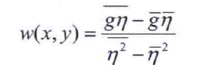

其中，$ \overline{η}$为邻域Sxy的平均值，$ \overline{g}$为g在邻域Sxy的平均值。
